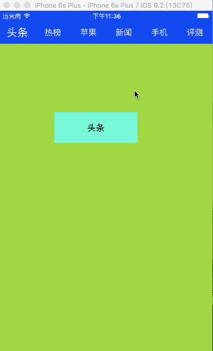

# CLTitleView
## 一款可滑动的标题栏控件.....仿中关村在线标题栏效果
<br>

###  - 效果图
- 

### 使用方法
- 导入头文件

```
#import "CLTitleView.h"
```
- 初始化

 ``` 
CLTitleView *titleView = [CLTitleView titleViewWithFrame:CGRectMake(0, 0, [UIScreen mainScreen].bounds.size.width, 44) titles:self.titles];
 ```
- 设置代理

```
// 1.先遵守代理协议
@interface ViewController () <CLTitleViewDelegate>
@end

// 2.设置代理对象
titleView.delegate = self;

// 3.实现代理方法
#pragma mark - CLTitleViewDelegate 
- (void)titleView:(CLTitleView *)titleView didSelectTitleItemFromIndex:(NSInteger)from toIndex:(NSInteger)to {
  
}

```


